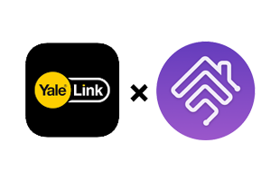

<p align="center">

</p>


[中文版](./README_zh.md)

# Yale Link Homebridge Plugin

This is a homebridge plugin that add HomeKit compatibility to your Yale Link Bridge devices.


## Hardware Requirement

Yale sales different model of locks and bridges in different countries. This plugin only works for Asian models.

Please make sure your Yale lock, bluetooth module and Yale Link Bridge are same as the items in the following links. You need to have all 3 kind of devices to use this plugin.

* [A Yale lock which is compatible with Yale Link](https://www.yaletaiwanstore.com.tw/product_category/yale-link)
* [Yale Link Bluetooth Module](https://www.yalehome.co.in/en/products/products-categories/smart-products/accessories/yale-link-bluetooth-module/)
* [Yale Link Bridge](https://www.yaletaiwanstore.com.tw/products/yale-link-bridge/)

### ⚠️⚠️⚠️ This plugin may not work with the new ([Yale Access](https://www.yalehome.com.au/en/products/categories/smart-products/yale-access-kit/)) bridge ⚠️⚠️⚠️


## Installation

After Homebridge has been installed:

`sudo npm i -g homebridge-yale-link@latest`

## Prepairing your lock

I strongly suggeset the lock be set to 'Master Mode' before setup this plugin because only Master Mode can delete specific bluetooth device instead of reset all devices.

1. If you already installed Yale Link app on your iPhone and paired with your lock, please unpair the lock and delete the Yale Link app.
2. Reinstall Yale Link app on your iPhone, then pair the lock to your iPhone normally.
3. Login Yale Link with Google Account. This plugin only supports Google Account now.
4. Connect to Yale Link Bridge in the app and make sure that it works. (Can unlock / lock the door with WiFi instead of bluetooth.)
5. Delete the Yale Link App from your iPhone. DO NOT LOGOUT BEFORE YOU DELETE IT.
6. Add the following example config to your Homebridge config. Change `loginId` to your Google Account. Leave `terminalId` and `deviceId` as `FFFFFFFFFFFF` if you don't know the real IDs.
7. Run Homebridge, now you would see an instruction which shows a link to Google authentication URL. Open the link and login with the same Google Account you filled in the config.
8. After login your account, it would show a blank page. Open developer tool in your browser and run this script to console to show the access token directly:
`let regex = new RegExp(/access_token\\\" \: \\\"(.*)\\\",/gi); regex.exec(document.getElementsByTagName("script")[0].innerHTML.match(regex))[1];`
9. Copy the token starts with `ya29.` and paste it to `yalelink_token` file which is in the same directory of `config.json` of Homebridge. Save the file, and then restart Homebridge.
10. After restart, it would show the terminalId and deviceId. Paste them to your config and restart again.
11. Now you can install Yale Link and pair to your lock again on your iPhone. Remember, don't delete the paired device in previous steps or you need to follow this tutorial from 1. again.

## Config

Simple config example:

```
{
    "bridge": {
    ...
    },
    "accessories": [
    ...
    ],
    "platforms": [
    {
        "platform": "YaleLinkPlatform",
        "loginId": "example@gmail.com",
        "isNoOtherTerminal": false,
        "terminalId": "FFFFFFFFFFFF",
        "accessories": [{
            "name": "My Door Lock",
            "deviceId": "FFFFFFFFFFFF"
        }]
    }
    ]
}
```

## Options

| **Attributes** | **Required** | **Usage** | **Default** | **Options** |
|----------------|--------------|-----------|-------------|-------------|
| loginId | **YES** | The account to login Yale Link | 
| terminalId | **YES** | An ID of your device, which is generated randomly when you install Yale Link app | FFFFFFFFFFFF |
| isNoOtherTerminal |  | Yale Link Bridge only allows one device to connect it in the same time. So the app must ask the server to give permission everytime, which casues more delay when controlling the lock. If this option set to **true**, then this plugin won't ask for permission everytime and boost the response latency. However, if you use both Yale Link app with bridge (WiFi control) and homebridge, this would cause conflicts and make homebridge plugin not to work. | false | true/false
| debug | | Debug mode. Show more detailed messages in the log. | false | true/false
| accessories.name | **YES** | Name of the lock | |
| accessories.deviceId | **YES** | An unique ID of the bluetooth module | FFFFFFFFFFFF |

## Demo

