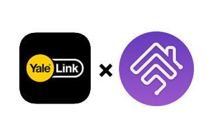

<p align="center">

</p>


[English version](./README.md)

# Yale Link Homebridge Plugin

讓您的 Yale 電子鎖可以使用 Homebridge 來加入到 HomeKit 中。

## 硬體需求

Yale 在不同地區販售不同型號的電子鎖，此套件僅適用在亞洲地區販售的 Yale 電子鎖、藍牙模組，以及 Yale Link Bridge。

請確認您的裝置在下方的列表中，且外型如連結中的圖片一致。您必須要「同時有以下三種裝置」才能使用本套件。

* [支援遠端解鎖的 Yale 電子鎖](https://www.yaletaiwanstore.com.tw/product_category/yale-link)
* [Yale Link 藍牙模組](https://www.yalehome.co.in/en/products/products-categories/smart-products/accessories/yale-link-bluetooth-module/)
* [Yale Link Bridge](https://www.yaletaiwanstore.com.tw/products/yale-link-bridge/)

## 安裝

在 Homebridge 安裝的情況下輸入以下指令：

`sudo npm i -g homebridge-yale-link@latest`

## 準備您的門鎖

個人強烈建議把門鎖先換成「安全模式」（英文稱為 Master Mode）。因為在一般模式下，只能一次刪除所有藍牙裝置，僅有在安全模式之下，您才能單獨刪除/添加與門鎖配對的藍牙裝置。

1. 若您的 iPhone 已經安裝 Yale Link App 並綁定了 Bridge，請先在該手機取消綁定，並且刪除 App。
2. 在 iPhone 上重新安裝 Yale Link App，然後以正常的流程用藍牙配對門鎖。
3. 使用 Google 帳號登入 Yale Link App。本套件目前只支援 Google 帳號。
4. 在門鎖設定中，選擇連線 Bridge。之後確認您的 App 是否能成功遠端操控門鎖（關掉藍牙，確定在 WiFi 模式下可以控制門鎖）。
5. 直接在 iPhone 刪除 Yale Link App。請注意，刪除 App 前**不要登出帳號**。
6. 加入下方的設定到您的 Homebridge 設定檔中，修改 `loginId` 為你的 Google 帳號。如果你不知道 `terminalId` 以及 `deviceId`，就先保留這兩個值為 `FFFFFFFFFFFF`。
7. 執行 HomeBridge，在終端機畫面會顯示一個 Google 驗證的 URL，使用電腦瀏覽器打開該 URL，並使用您在設定檔中輸入的帳號登入。
8. 成功登入的話，畫面會顯示為一個空白的網頁。使用瀏覽器的開發者工具，貼上下面的指令到控制台（Console）中：
`let regex = new RegExp(/access_token\\\" \: \\\"(.*)\\\",/gi); regex.exec(document.getElementsByTagName("script")[0].innerHTML.match(regex))[1];`
9. 此時，應該會顯示 `ya29.` 開頭的 token，把 token 複製，貼上與 Homebridge 的 `config.json` 同目錄下的 `yalelink_token` 檔案內，儲存檔案然後重開 Homebridge。
10. 重開 Homebridge 之後，此時應該會顯示 `terminalId` 以及 `deviceId` 的值，把它們貼到設定檔後，再次重開 Homebridge 就可以了。
11. 確定成功後，您可以重新在手機上安裝 Yale Link App 並配對門鎖以使用。請勿在門鎖設定刪除剛剛配對的裝置，否則您必須重新從 1. 開始。

## 設定檔

設定範例：

```
{
    "bridge": {
    ...
    },
    "accessories": [
    ...
    ],
    "platforms": [
    {
        "platform": "YaleLinkPlatform",
        "loginId": "example@gmail.com",
        "isNoOtherTerminal": false,
        "terminalId": "FFFFFFFFFFFF",
        "accessories": [{
            "name": "My Door Lock",
            "deviceId": "FFFFFFFFFFFF"
        }]
    }
    ]
}
```

## 選項

| **名詞** | **必須** | **說明** | **預設值** | **選項** |
|----------------|--------------|-----------|-------------|-------------|
| loginId | **YES** | Yale Link 的登入 ID | 
| terminalId | **YES** | 手機的 UUID，每次重新安裝 Yale Link 時會隨機生成 | FFFFFFFFFFFF |
| isNoOtherTerminal |  | 由於 Yale Link Bridge 每次只允許一個裝置操作，因此 App 每次在使用時，會先跟伺服器要求控制權，再進行操作。這個行為使得控制門鎖時，會延遲幾秒鐘。若此選項設定為 **true**，則此套件不會每次都先要求控制權再操作，這樣可以大幅增加門鎖的反應速度。然而，若您同時有其他手機連到 Yale Link Bridge，則開啟此設定會使得此套件進行操作時失效。 | false | true/false
| debug | | 開啟除錯模式，會顯示更多的訊息。  | false | true/false
| accessories.name | **YES** | 門鎖的名稱 | |
| accessories.deviceId | **YES** | 藍牙模組的 ID | FFFFFFFFFFFF |

## Demo

